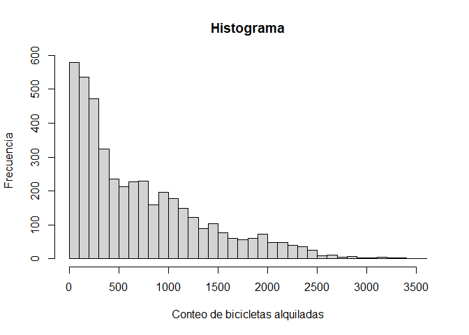

Seoul Bike Sharing
================
Isaac y Carmen
2024-10-03

- [Introducción](#introducción)
- [Business understanding](#business-understanding)
- [Data understanding](#data-understanding)
- [Análisis exploratorio de datos](#análisis-exploratorio-de-datos)
- [Técnicas de reducción de la
  dimensión](#técnicas-de-reducción-de-la-dimensión)
- [Análisis no supervisado](#análisis-no-supervisado)
- [Análisis supervisado](#análisis-supervisado)
- [Comparación y selección de
  modelos](#comparación-y-selección-de-modelos)
- [Conclusiones](#conclusiones)

# Introducción

El conjunto de datos contiene el recuento de bicicletas públicas
alquiladas por hora en el sistema de bicicletas compartidas de Seúl, con
los correspondientes datos meteorológicos e información sobre
vacaciones.

Los datos han sido extraídos del [repositorio UCI Machine
Learning](https://archive.ics.uci.edu/dataset/560/seoul+bike+sharing+demand).
Según la propia descripción del repositorio, actualmente se están
introduciendo bicicletas de alquiler en muchas ciudades urbanas para
mejorar la comodidad de la movilidad. En el sistema de alquiler, es
importante que las bicicletas estén disponibles y accesibles al público
en el momento adecuado, ya que así se reduce el tiempo de espera. El
objetivo de este sistema es proporcionar a la ciudad de un suministro
estable de bicicletas de alquiler y, por ello, es crucial predecir
correctamente el número de bicicletas necesarias a cada hora para el
suministro estable de bicicletas de alquiler. El conjunto de datos
contiene información meteorológica (temperatura, humedad, velocidad del
viento, visibilidad, punto de rocío, radiación solar, nevadas,
precipitaciones), el número de bicicletas alquiladas por hora e
información sobre la fecha. Además, no contiene valores missing o
perdidos.

Según la descripción oficial de los datos, las variables que conforman
el conjunto de datos son:

- Date: Fecha en formato year-month-day
- Rented Bike Count: Conteo de bicicletas alquiladas cada hora
- Hour: Hora del día
- Temperature: Temperatura en grados Celsius
- Humidity: Humedad en %
- Wind Speed: Velocidad del viento en m/s
- Visibility: Visibilidad 10m
- Dew point temperature: Temperatura del punto de condensación en grados
  Celsius
- Solar radiation: Radiación solar en MJ/m2
- Rainfall: Lluvia en mm (equivalente a l/m2)
- Snowfall: Nieve en cm
- Seasons: Winter, Spring, Summer, Autumn
- Holiday: Holiday/No holiday
- Functional Day: NoFunc (Non Functional Hours), Fun (Functional hours)

Nótese que el problema original es de regresión, es decir, la variable
que se quiere predecir (número de bicicletas que se alquilan a la hora)
es continua. Como para esta práctica estamos interesados en problemas de
clasificación, tendremos que convertir dicho target continuo en un
target binario. Así, la variable a predecir pasará de “número de
biciletas que se alquilan por hora” a “la cantidad de bicicletas que se
alquilan a la hora supera un determinado umbral”. Nótese que la
determinación de dicho umbral debe ir fijado por el cliente/interesado
que solicita a un equipo de Ciencia de Datos la realización de este
proyecto. Al no tener en este caso cliente dado el entorno educativo en
el que se encuadra el proyecto, tendremos que determinar dicho umbral en
función del comportamiento de dicha variable.

# Business understanding

Planteamos algunas preguntas sobre nuestros datos:

- ¿El clima influye en el alquiler de bicicletas?
- ¿Influye más la nieve o la lluvia?
- ¿Nieva mucho en Seúl?

# Data understanding

A continuación leemos los datos y vemos el tipo de variables.

``` r
# lectura de datos en csv
# SeoulBikeData <- read.csv("datos/SeoulBikeData.csv")
library(readr)
SeoulBikeData <- read_csv("https://raw.githubusercontent.com/carmenlancho/Practica_SeoulBikeSharing/refs/heads/main/datos/SeoulBikeData.csv")
SeoulBikeData <- SeoulBikeData %>% select_all(funs(gsub(" ", "_", .)))
ntotal <- dim(SeoulBikeData)[1] # numero de observaciones
ptotal <- dim(SeoulBikeData)[2] # numero de columnas
```

Comprobamos que tenemos $n=$`8760` observaciones y `14` variables en la
base de datos.

Realizamos la división de nuestros datos en 3 muestras: entrenamiento,
validación y test.

``` r
# mediante una semilla conseguimos que el ejercicio sea reproducible
set.seed(1)

# creamos índices
indices <- 1:ntotal
ntrain <- ntotal * .5
ntest <- ntotal * .25
nval <- ntotal - (ntrain+ntest)
indices.train <- sample(indices, ntrain, replace = FALSE)
indices.test <- sample(indices[-indices.train],ntest,replace=FALSE)
indices.val <- indices[-c(indices.train,indices.test)]

# Usamos el 50% de la base de datos como conjunto de entrenamiento
# 25% para test
# 25% para validación
train  <- SeoulBikeData[indices.train, ]
test   <- SeoulBikeData[indices.test, ]
val   <- SeoulBikeData[indices.val, ]
```

Vamos a echarle un ojo a las variables:

``` r
str(train)
```

    ## tibble [4,380 × 14] (S3: tbl_df/tbl/data.frame)
    ##  $ Date                    : chr [1:4380] "12/01/2018" "30/10/2018" "17/06/2018" "18/11/2018" ...
    ##  $ Rented_Bike_Count       : num [1:4380] 419 782 1819 905 1551 ...
    ##  $ Hour                    : num [1:4380] 8 11 22 13 17 4 1 22 20 0 ...
    ##  $ Temperature(C)          : num [1:4380] -15.1 7.5 22.2 9.9 17.2 -15.4 6.9 2.6 13.9 3.5 ...
    ##  $ Humidity(%)             : num [1:4380] 44 36 70 37 81 30 86 57 97 62 ...
    ##  $ Wind_speed_(m/s)        : num [1:4380] 1.2 1.4 0.5 2.1 1.2 2.5 0.7 3.1 2.5 0.4 ...
    ##  $ Visibility_(10m)        : num [1:4380] 2000 1993 1056 1900 2000 ...
    ##  $ Dew_point_temperature(C): num [1:4380] -24.6 -6.6 16.4 -4.1 13.9 -29.1 4.7 -5 13.4 -3.1 ...
    ##  $ Solar_Radiation_(MJ/m2) : num [1:4380] 0 1.98 0 1.32 0.57 0 0 0 0 0 ...
    ##  $ Rainfall(mm)            : num [1:4380] 0 0 0 0 0 0 0 0 0 0 ...
    ##  $ Snowfall_(cm)           : num [1:4380] 0 0 0 0 0 0.9 0 0 0 0 ...
    ##  $ Seasons                 : chr [1:4380] "Winter" "Autumn" "Summer" "Autumn" ...
    ##  $ Holiday                 : chr [1:4380] "No Holiday" "No Holiday" "No Holiday" "No Holiday" ...
    ##  $ Functioning_Day         : chr [1:4380] "Yes" "Yes" "Yes" "Yes" ...

# Análisis exploratorio de datos

Comenzamos binarizando el target. Para decidir el punto de corte,
estudiamos las variable.

``` r
summary(train$Rented_Bike_Count)
```

    ##    Min. 1st Qu.  Median    Mean 3rd Qu.    Max. 
    ##     0.0   197.0   524.0   713.2  1063.0  3556.0

Obtenemos también el valor más frecuente con la función `mfv()` de la
librería `statip`.

``` r
mfv(train$Rented_Bike_Count)
```

    ## [1] 0

``` r
# Create the first histogram
hist(train$Rented_Bike_Count, main = "Histograma", xlab = "Conteo de bicicletas alquiladas",
     ylab = "Frecuencia",breaks = 50)
```



Este breve análisis muestra que la mediana está en torno a 500
bicicletas alquiladas por día, es decir, en el 50% de las horas se
alquilan entre `0` y `524` bicicletas y el restante 50% entre `524` y
`3556` bicicletas. Gracias al histograma observamos que son más
frecuentes las horas en las que se alquilan pocas bicis que aquellas en
las que se alquilan muchas. De hecho, el valor más frecuente es `0`.
Además, como se refleja en el histograma, a partir de 500 el cambio en
la frecuencia de alquiler es más paulatino. Por todo esto, y teniendo en
cuenta el objetivo de la ciudad de poder cubrir las necesidades de
alquiler de bicicletas, se decide binarizar el target con el umbral 500.
Así, el target tomará valor 1 cuando se alquilen más de 500 bicicletas
por hora y 0 cuando se alquilen menos.

``` r
SeoulBikeData$target <- ifelse(SeoulBikeData$Rented_Bike_Count > 500,1,0)
table(SeoulBikeData$target)
```

    ## 
    ##    0    1 
    ## 4363 4397

# Técnicas de reducción de la dimensión

# Análisis no supervisado

# Análisis supervisado

# Comparación y selección de modelos

# Conclusiones
